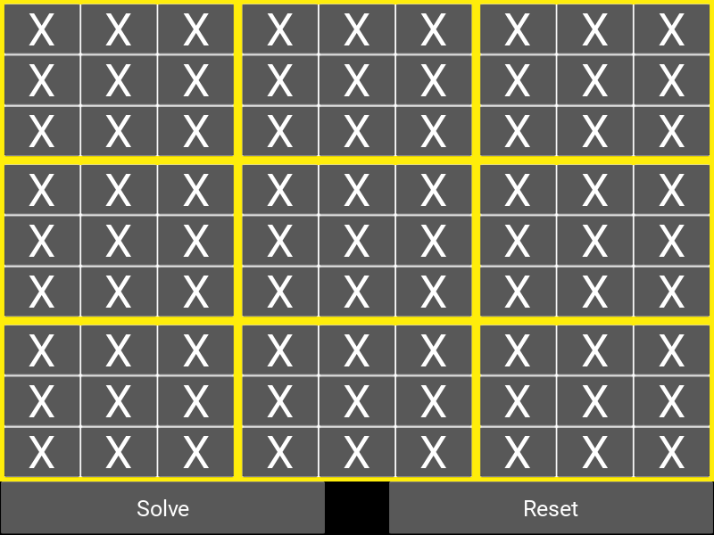
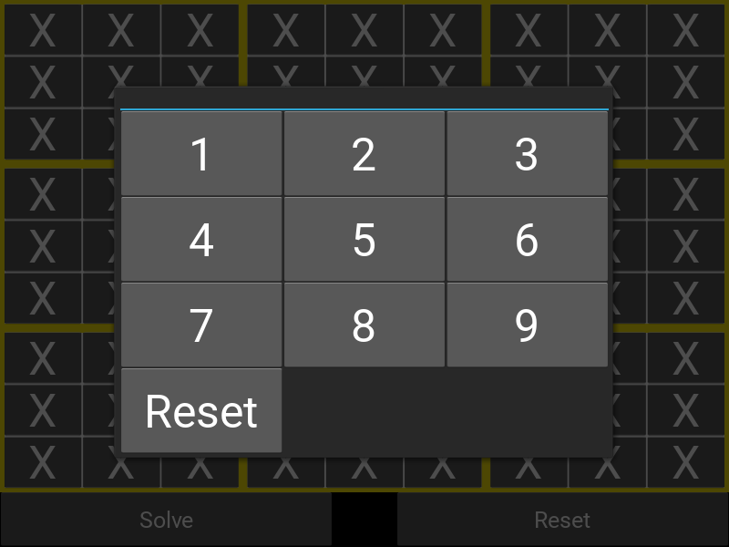
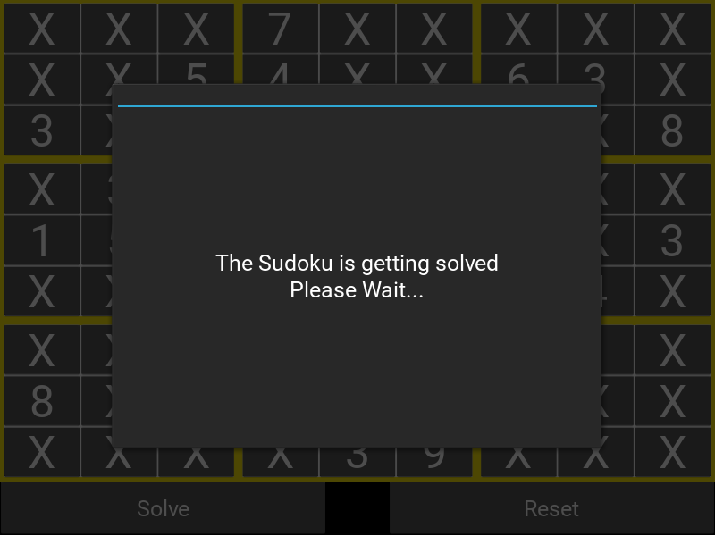

# Sudoku Solver

A very simple [Kivy](https://kivy.org/) application to solve Sudoku.

## Download

It is available as an Android App (.apk file).

https://github.com/pgmystery/sudoku_solver/releases

## Screenshots

The default screen:

Select a number for the specific field:

The Sudoku is getting solved...

